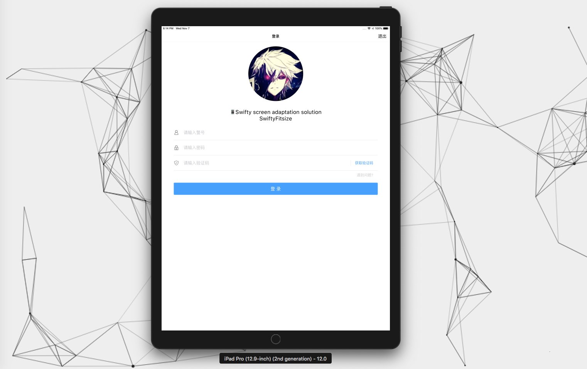
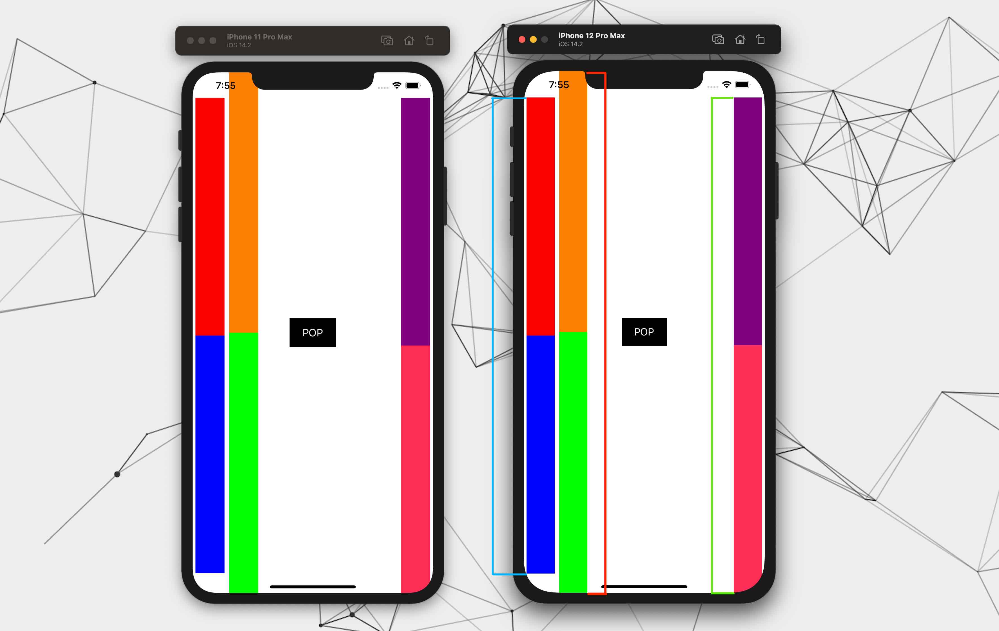
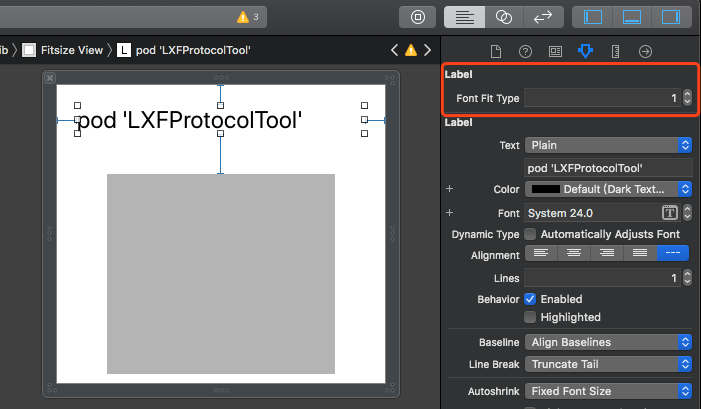

# SwiftyFitsize

[](https://travis-ci.org/LinXunFeng/SwiftyFitsize)
[](https://cocoapods.org/pods/SwiftyFitsize)
[](https://cocoapods.org/pods/SwiftyFitsize)
[](https://cocoapods.org/pods/SwiftyFitsize)

## Example

克隆或下载仓库到本地后，请先运行 `pod install` , 再打开 `SwiftyFitsize.xcworkspace`

## Requirements

- iOS 9.0+
- Xcode 10.2+
- Swift 5+

## Installation

- Cocoapods

```ruby
use_frameworks!
pod 'SwiftyFitsize'
```


## Exhibition





## Usage

##### 一、运算符

> 无论是 `~` 还是 `≈` 对 `iPhone` 的适配效果是一样的。而对 `iPad` 而言，`iPad` 的宽度太大，使用 `≈` 还是会按宽度比例进行运算，就会显示特别臃肿，这时使用 `~` 在显示上就会比较合适。
>
> - `~` 在  `≈` 的基础上针对 `iPad` 的适配大小后再去乘上 `iPadFitMultiple` 。
>- 一般情况下直接使用 `~` 即可。
> - 其它运算符亦是如此，具体请看下方的说明表


| 运算符 | 说明                                                         |
| ------ | ------------------------------------------------------------ |
| `~`    | 对比宽度，当设备为 `iPad` 时，适配后的 `value` 会再乘上 `iPadFitMultiple` |
| `≈`    | 对比宽度，强制适配，不论是 `iPhone` 还是 `iPad` 都不会乘上 `iPadFitMultiple` |
| `∣`    | 对比高度，对应 `~` ，整屏高度                                |
| `∥`    | 对比高度，对应 `≈` ，整屏高度                                |
| `∣=`   | 对比高度，对应 `∣` ，安全区域内的高度                        |
| `∥=`   | 对比高度，对应 `∥` ，安全区域内的高度                        |
| `∣-`   | 对比高度，对应 `∣` ，除去刘海区域的安全区域内的高度          |
| `∥-`   | 对比高度，对应 `∥` ，除去刘海区域的安全区域内的高度          |

各高度适配的对比

>- 红色:  `∣` 和 `∥` ，以整个屏幕的高度进行适配
>- 蓝色:  `∣=` 和 `∥=`  以中心安全区域的高度进行适配
>- 绿色:  `∣-` 和 `∥-`  以包括底部的安全区域进行适配




举个例子

`~` : 当设备为 `iPad` 时，适配后的值会与 `iPadFitMultiple` 相乘

```swift
100~
UIFont.systemFont(ofSize: 14)~
CGPoint(x: 10, y: 10)~
CGRect(x: 10, y: 10, width: 100, height: 100)~
UIEdgeInsetsMake(10, 10, 10, 10)~
```


`≈` :  (option + x)  适配后的值不会与 `iPadFitMultiple` 相乘

```swift
100≈
UIFont.systemFont(ofSize: 14)≈
CGPoint(x: 10, y: 10)≈
CGRect(x: 10, y: 10, width: 100, height: 100)≈
UIEdgeInsetsMake(10, 10, 10, 10)≈
```


修改 `参照宽度` 、`参照高度`、`是否为iPhoneX系列的参照高度`与 `iPadFitMultiple`  可以调用如下方法

```swift
/// 设置参照的相关参数
///
/// - Parameters:
///   - width: 参照的宽度
///   - height: 参照的高度
///   - isIPhoneXSeriesHeight: 是否为iPhoneX系列的参照高度
///   - iPadFitMultiple: iPad 在适配后所得值的倍数 (0 , 1]
SwiftyFitsize.reference(
  width: 414, 
  height: 896, 
  isIPhoneXSeriesHeight: true, 
  iPadFitMultiple: 0.5
)
```


##### 二、支持 xib 和 storyboard

```swift
enum SwiftyFitType: Int {
    /// Original Value
    case none = 0
    /// ~
    case flexibleWidth = 1
    /// ≈
    case forceWidth = 2
    /// ∣
    case flexibleHeight = 3
    /// ∥
    case forceHeight = 4
    /// ∣=
    case flexibleSafeAreaCenterHeight = 5
    /// ∥=
    case forceSafeAreaCenterHeight = 6
    /// ∣-
    case flexibleSafeAreaWithoutTopHeight = 7
    /// ∥-
    case forceSafeAreaWithoutTopHeight = 8
}
```

- Font Fitsize

支持的UI控件有： `UILabel` `UIButton` `UITextView` `UITextField`

`FontFitType` 的值请参考上方的 `enum SwiftyFitType`




- Constraint Fitsize

约束适配同上


`iPad` 关于 `~` 与 `≈`  在使用上的对比


##### 三、Objective-C

> 1. 由于 `OC` 不支持运算符重载，所以只能用宏来适配。
>
> 2. `Xib` 和  `Storyboard`  则跟上方提及的使用方式相同。


`Swift运算符` 与 `OC宏` 对应表

| Swift运算符 | OC宏         |
| ----------- | ------------ |
| `~`         | `SF_xx`      |
| `≈`         | `SFZ_xx`     |
| `∣`         | `SF_FH_xx`   |
| `∥`         | `SFZ_FH_xx`  |
| `∣=`        | `SF_SCH_xx`  |
| `∥=`        | `SFZ_SCH_xx` |
| `∣-`        | `SF_SBH_xx`  |
| `∥-`        | `SFZ_SBH_xx` |

注: `xx` 支持如下类型 `Font` 、`Int`、`Float`、`Point`、`Size`、`Rect`、`EdgeInsets`


- 导入

```objc
@import SwiftyFitsize;
```

- 修改 `参照宽度` 、`参照高度`、`是否为iPhoneX系列的参照高度`与 `iPadFitMultiple`  

```objc
[SwiftyFitsize referenceWithWidth:414
                           height:896
            isIPhoneXSeriesHeight:YES
                  iPadFitMultiple:0.6];
```

- `~`

```objc
UIFont *font = [UIFont systemFontOfSize:14];

UIFont *font1 = font.sf;
UIFont *font2 = SF_Font(font);

CGFloat num = SF_Float(14);
CGPoint point = SF_Point(CGPointMake(10, 10));
CGSize size = SF_Size(CGSizeMake(100, 100));
CGRect rect = SF_Rect(CGRectMake(10, 10, 100, 100));
UIEdgeInsets edge = SF_EdgeInsets(UIEdgeInsetsMake(0, 0, 100, 100));

```

- `≈`

```objc
UIFont *font1 = font.sfz;
UIFont *font2 = SFZ_Font(font);

CGFloat num = SFZ_Float(14);
CGPoint point = SFZ_Point(CGPointMake(10, 10));
CGSize size = SFZ_Size(CGSizeMake(100, 100));
CGRect rect = SFZ_Rect(CGRectMake(10, 10, 100, 100));
UIEdgeInsets edge = SFZ_EdgeInsets(UIEdgeInsetsMake(0, 0, 100, 100));
```

其它运算符亦是如此使用


## Misc

下面列出一些设备对应的分辨率，方便查找

| 设备          | 逻辑分辨率(point) | 设备分辨率(pixel) |
| ------------- | ----------------- | ----------------- |
| SE            | 320x568           | 640x1136          |
| 6(S)／7／8    | 375x667           | 750x1334          |
| 6(S)+／7+／8+ | 414x736           | 1080x1920         |
| X(S)          | 375x812           | 1125x2436         |
| XR            | 414x896           | 828x1792          |
| XS Max        | 414x896           | 1242x2688         |


## License

SwiftyFitsize is available under the MIT license. See the LICENSE file for more info.


## Author

- LinXunFeng
- email: [linxunfeng@yeah.net](mailto:linxunfeng@yeah.net)
- Blogs: [全栈行动](https://fullstackaction.com/) | [LinXunFeng‘s Blog](http://linxunfeng.top/)  | [掘金](https://juejin.im/user/58f8065e61ff4b006646c72d/posts) 


## Other

| </img> | </img> | </img> |
| :----------------------------------------------------------: | :----------------------------------------------------------: | :----------------------------------------------------------: |
|                                                              |                                                              |                                                              |

