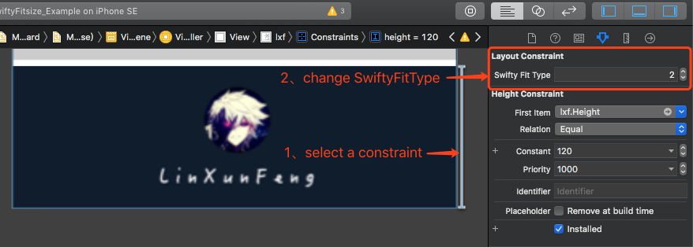
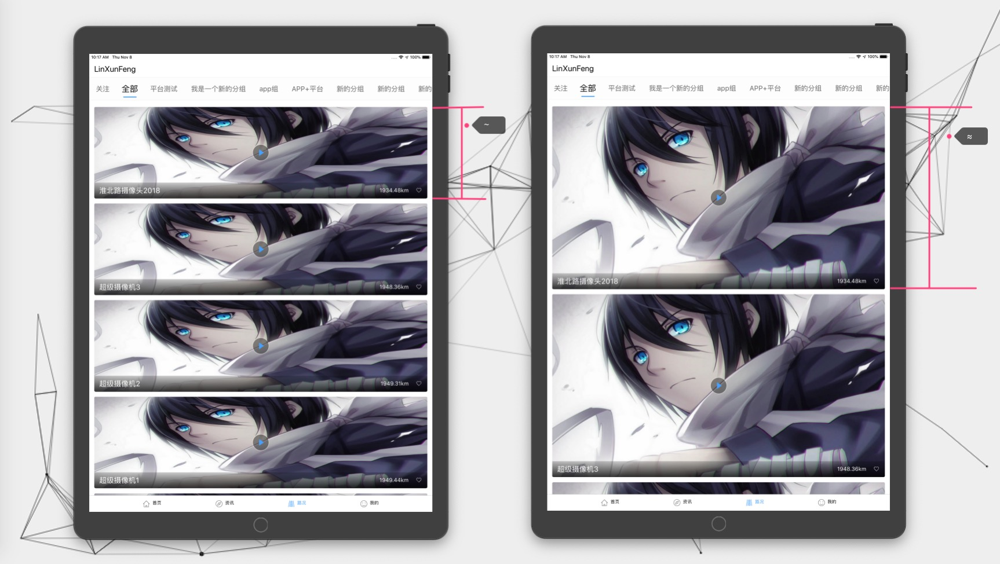

# SwiftyFitsize

[](https://travis-ci.org/LinXunFeng/SwiftyFitsize)
[](https://cocoapods.org/pods/SwiftyFitsize)
[](https://cocoapods.org/pods/SwiftyFitsize)
[](https://cocoapods.org/pods/SwiftyFitsize)

## Example

克隆或下载仓库到本地后，请先运行 `pod install` , 再打开 `SwiftyFitsize.xcworkspace`

## Requirements

- iOS 9.0+
- Xcode 10.0+

## Installation

- Cocoapods

```ruby
pod 'SwiftyFitsize'
```


## Exhibition


## Usage

##### 一、操作符 `~` 与 `≈`

> 无论是 `~` 还是 `≈` 对 `iPhone` 的适配效果是一样的。而对 `iPad` 而言，`iPad` 的宽度太大，使用 `≈` 还是会按宽度比例进行运算，就会显示特别臃肿，这时使用 `~` 在显示上就会比较合适。
>
> - `~` 在  `≈` 的基础上针对 `iPad` 的适配大小后再去乘上 `iPadFitMultiple` 。
>
> - 一般情况下直接使用 `~` 即可。


`~` : 当设备为 `iPad` 时，适配后的值会与 `iPadFitMultiple` 相乘

```swift
100~
UIFont.systemFont(ofSize: 14)~
CGPoint(x: 10, y: 10)~
CGRect(x: 10, y: 10, width: 100, height: 100)~
UIEdgeInsetsMake(10, 10, 10, 10)~
```


`≈` :  (option + x)  适配后的值不会与 `iPadFitMultiple` 相乘

```swift
100≈
UIFont.systemFont(ofSize: 14)≈
CGPoint(x: 10, y: 10)≈
CGRect(x: 10, y: 10, width: 100, height: 100)≈
UIEdgeInsetsMake(10, 10, 10, 10)≈
```


修改 `参照宽度` 与 `iPadFitMultiple`  可以调用以下方法

```swift
/// 设置参照的相关参数
///
/// - Parameters:
///   - width: 参照的宽度
///   - iPadFitMultiple: iPad 在适配后所得值的倍数 (0 , 1]
SwiftyFitsize.reference(width: 414, iPadFitMultiple: 0.5)
```


##### 二、支持 xib 和 storyboard

```swift
enum SwiftyFitType: Int {
    /// Original Value
    case none = 0
    /// ~
    case flexible = 1
    /// ≈
    case force = 2
}
```

- Font Fitsize

支持的UI控件有： `UILabel` `UIButton` `UITextView` `UITextField`

`FontFitType` 的值请参考上方的 `enum SwiftyFitType`


- Constraint Fitsize

约束适配同上




`iPad` 关于 `~` 与 `≈`  在使用上的对比




## Author

LinXunFeng, 598600855@qq.com

## License

SwiftyFitsize is available under the MIT license. See the LICENSE file for more info.
